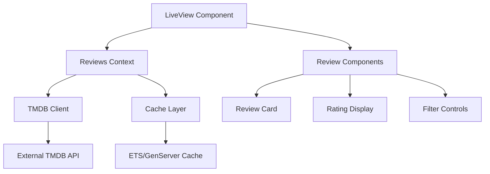

# Design Document

## Overview

The movie and TV reviews feature will integrate with external APIs (primarily TMDB) to fetch and display user reviews and ratings for movies and TV shows. The system will provide a comprehensive review viewing experience with filtering, sorting, and efficient loading mechanisms.

## Architecture

### High-Level Components



### Data Flow

1. User navigates to movie/TV show details page
2. LiveView requests reviews from Reviews context
3. Reviews context checks cache first
4. If not cached, fetches from TMDB API
5. Reviews are cached and returned to LiveView
6. LiveView renders reviews with pagination/filtering

## Components and Interfaces

### Reviews Context (`lib/flixir/reviews.ex`)

Primary business logic module for handling reviews:

```elixir
defmodule Flixir.Reviews do
  @doc "Fetch reviews for a movie or TV show"
  def get_reviews(media_type, media_id, opts \\ [])
  
  @doc "Get aggregated rating statistics"
  def get_rating_stats(media_type, media_id)
  
  @doc "Filter and sort reviews"
  def filter_reviews(reviews, filters)
  
  @doc "Paginate reviews"
  def paginate_reviews(reviews, page, per_page)
end
```

### TMDB Reviews Client (`lib/flixir/reviews/tmdb_client.ex`)

Handles external API communication:

```elixir
defmodule Flixir.Reviews.TMDBClient do
  @doc "Fetch reviews from TMDB API"
  def fetch_reviews(media_type, media_id, page \\ 1)
  
  @doc "Parse TMDB review response"
  def parse_review_response(response)
end
```

### Review Cache (`lib/flixir/reviews/cache.ex`)

Caching layer for performance:

```elixir
defmodule Flixir.Reviews.Cache do
  @doc "Get cached reviews"
  def get(cache_key)
  
  @doc "Store reviews in cache"
  def put(cache_key, reviews, ttl \\ :timer.hours(1))
  
  @doc "Generate cache key"
  def cache_key(media_type, media_id, filters)
end
```

### LiveView Integration (`lib/flixir_web/live/movie_details_live.ex`)

Enhanced movie details page with reviews:

```elixir
defmodule FlixirWeb.MovieDetailsLive do
  # Existing movie details functionality
  # + Reviews section with:
  # - Review loading and display
  # - Filtering and sorting controls
  # - Pagination handling
  # - Error state management
end
```

### Review Components

#### Review Card Component (`lib/flixir_web/components/review_card.ex`)

```elixir
defmodule FlixirWeb.Components.ReviewCard do
  @doc "Renders individual review with author, rating, content"
  def review_card(assigns)
  
  @doc "Handles expandable review content"
  def expandable_content(assigns)
  
  @doc "Renders spoiler warnings"
  def spoiler_warning(assigns)
end
```

#### Rating Display Component (`lib/flixir_web/components/rating_display.ex`)

```elixir
defmodule FlixirWeb.Components.RatingDisplay do
  @doc "Shows aggregated rating with stars/score"
  def rating_summary(assigns)
  
  @doc "Shows rating distribution breakdown"
  def rating_breakdown(assigns)
end
```

#### Review Filters Component (`lib/flixir_web/components/review_filters.ex`)

```elixir
defmodule FlixirWeb.Components.ReviewFilters do
  @doc "Renders sort and filter controls"
  def filter_controls(assigns)
  
  @doc "Handles filter state changes"
  def handle_filter_change(socket, filter_params)
end
```

## Data Models

### Review Struct

```elixir
defmodule Flixir.Reviews.Review do
  @type t :: %__MODULE__{
    id: String.t(),
    author: String.t(),
    author_details: map(),
    content: String.t(),
    created_at: DateTime.t(),
    updated_at: DateTime.t(),
    url: String.t(),
    rating: float() | nil
  }
  
  defstruct [:id, :author, :author_details, :content, :created_at, :updated_at, :url, :rating]
end
```

### Rating Stats Struct

```elixir
defmodule Flixir.Reviews.RatingStats do
  @type t :: %__MODULE__{
    average_rating: float(),
    total_reviews: integer(),
    rating_distribution: map()
  }
  
  defstruct [:average_rating, :total_reviews, :rating_distribution]
end
```

## Error Handling

### API Error Handling

- **Network Timeouts**: Retry with exponential backoff
- **Rate Limiting**: Implement request queuing and respect rate limits
- **Invalid Responses**: Log errors and show user-friendly messages
- **Service Unavailable**: Fall back to cached data when possible

### User Experience Error Handling

- **Loading States**: Show skeleton loaders during API calls
- **Empty States**: Clear messaging when no reviews are available
- **Error States**: Actionable error messages with retry options
- **Partial Failures**: Show available data even if some requests fail

### Error Recovery Strategies

```elixir
defmodule Flixir.Reviews.ErrorHandler do
  @doc "Handle API errors with fallback strategies"
  def handle_api_error(error, context)
  
  @doc "Determine if cached data should be used"
  def use_cached_fallback?(error)
  
  @doc "Generate user-friendly error messages"
  def format_user_error(error)
end
```

## Testing Strategy

### Unit Tests

- **Reviews Context**: Test all business logic functions
- **TMDB Client**: Mock API responses and test parsing
- **Cache Layer**: Test cache hit/miss scenarios
- **Components**: Test rendering with various data states

### Integration Tests

- **LiveView Integration**: Test full user workflows
- **API Integration**: Test with real TMDB API (in development)
- **Error Scenarios**: Test network failures and recovery
- **Performance**: Test caching effectiveness

### Test Data Strategy

```elixir
defmodule Flixir.ReviewsFixtures do
  @doc "Generate sample review data for testing"
  def review_fixture(attrs \\ %{})
  
  @doc "Generate rating stats for testing"
  def rating_stats_fixture(attrs \\ %{})
  
  @doc "Mock TMDB API responses"
  def mock_tmdb_response(type, data \\ %{})
end
```

## Performance Considerations

### Caching Strategy

- **Review Cache**: 1-hour TTL for review data
- **Rating Cache**: 30-minute TTL for rating statistics
- **Cache Keys**: Include media type, ID, and filter parameters
- **Cache Invalidation**: Manual invalidation for data updates

### Pagination and Loading

- **Initial Load**: Load first 10 reviews immediately
- **Lazy Loading**: Load additional reviews on scroll/demand
- **Preloading**: Prefetch next page when user reaches 80% of current page
- **Memory Management**: Limit total reviews in memory to prevent bloat

### API Optimization

- **Request Batching**: Combine related API calls when possible
- **Rate Limit Respect**: Implement proper rate limiting
- **Connection Pooling**: Use HTTP connection pooling for efficiency
- **Timeout Configuration**: Set appropriate timeouts for different operations

## Security Considerations

### Input Validation

- **Media IDs**: Validate format and existence
- **Filter Parameters**: Sanitize and validate all filter inputs
- **Pagination**: Validate page numbers and limits

### Content Safety

- **Review Content**: Display reviews as-is from TMDB (trusted source)
- **Spoiler Handling**: Implement spoiler detection and hiding
- **XSS Prevention**: Ensure proper HTML escaping in templates

### API Security

- **API Key Management**: Store TMDB API key securely
- **Rate Limiting**: Implement client-side rate limiting
- **Error Information**: Don't expose sensitive error details to users