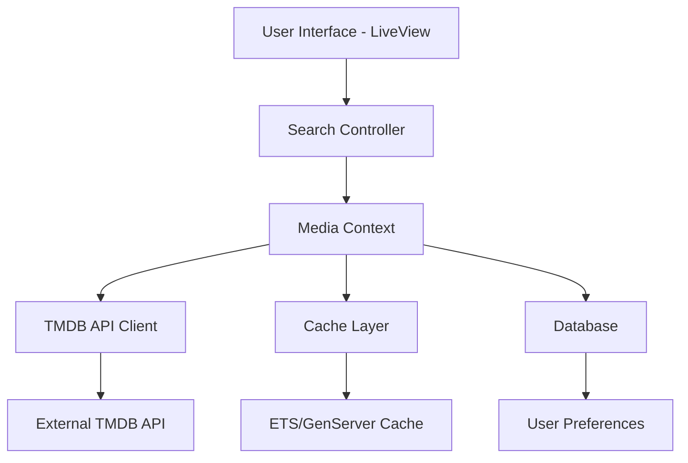

# Design Document

## Overview

The movie and TV search feature will be implemented as a Phoenix LiveView component that provides real-time search functionality. The system will integrate with The Movie Database (TMDB) API to fetch movie and TV show data, cache results for performance, and provide a responsive user interface with filtering and sorting capabilities.

## Architecture

### High-Level Architecture



### Component Breakdown

1. **LiveView Search Interface** - Real-time search UI with filters and sorting
2. **Media Context** - Business logic layer for search operations
3. **TMDB API Client** - External API integration using Req HTTP client
4. **Cache Layer** - In-memory caching for performance optimization
5. **Database Layer** - Optional storage for user preferences and search history

## Components and Interfaces

### 1. LiveView Search Component

**Location**: `lib/flixir_web/live/search_live.ex`

**Responsibilities**:
- Handle user search input with real-time updates
- Manage search state (query, filters, sorting, results)
- Display search results with pagination
- Handle loading states and error messages

**Key Functions**:
```elixir
def handle_event("search", %{"query" => query}, socket)
def handle_event("filter", %{"type" => type}, socket)
def handle_event("sort", %{"by" => sort_by}, socket)
```

### 2. Media Context

**Location**: `lib/flixir/media.ex`

**Responsibilities**:
- Orchestrate search operations
- Handle caching logic
- Validate and sanitize search parameters
- Transform API responses to internal data structures

**Key Functions**:
```elixir
def search_content(query, opts \\ [])
def get_content_details(id, type)
def clear_search_cache()
```

### 3. TMDB API Client

**Location**: `lib/flixir/media/tmdb_client.ex`

**Responsibilities**:
- Make HTTP requests to TMDB API
- Handle API authentication and rate limiting
- Parse and validate API responses
- Handle API errors and timeouts

**Key Functions**:
```elixir
def search_multi(query, page \\ 1)
def get_movie_details(movie_id)
def get_tv_details(tv_id)
```

### 4. Cache Manager

**Location**: `lib/flixir/media/cache.ex`

**Responsibilities**:
- Store search results in memory
- Implement TTL (time-to-live) for cache entries
- Handle cache invalidation
- Provide cache statistics

**Implementation**: GenServer with ETS table for fast lookups

## Data Models

### Search Result Schema

```elixir
defmodule Flixir.Media.SearchResult do
  @type t :: %__MODULE__{
    id: integer(),
    title: String.t(),
    media_type: :movie | :tv,
    release_date: Date.t() | nil,
    overview: String.t() | nil,
    poster_path: String.t() | nil,
    genre_ids: [integer()],
    vote_average: float(),
    popularity: float()
  }
  
  defstruct [:id, :title, :media_type, :release_date, :overview, 
             :poster_path, :genre_ids, :vote_average, :popularity]
end
```

### Search Parameters Schema

```elixir
defmodule Flixir.Media.SearchParams do
  @type t :: %__MODULE__{
    query: String.t(),
    media_type: :all | :movie | :tv,
    sort_by: :relevance | :release_date | :title | :popularity,
    page: integer()
  }
  
  defstruct query: "", media_type: :all, sort_by: :relevance, page: 1
end
```

## Error Handling

### API Error Handling

1. **Network Timeouts**: Implement 5-second timeout with retry logic
2. **Rate Limiting**: Handle 429 responses with exponential backoff
3. **API Errors**: Parse error responses and provide user-friendly messages
4. **Invalid Responses**: Validate API response structure

### User Experience Error Handling

1. **Empty Search**: Display helpful message for empty queries
2. **No Results**: Show "No results found" with search suggestions
3. **Loading States**: Display skeleton loaders during API calls
4. **Network Issues**: Show offline message with retry option

## Testing Strategy

### Unit Tests

1. **Media Context Tests**
   - Search parameter validation
   - Result transformation logic
   - Cache integration

2. **TMDB Client Tests**
   - API request formatting
   - Response parsing
   - Error handling scenarios

3. **Cache Tests**
   - Cache hit/miss scenarios
   - TTL expiration
   - Memory usage limits

### Integration Tests

1. **LiveView Tests**
   - Search flow end-to-end
   - Filter and sort functionality
   - Real-time updates

2. **API Integration Tests**
   - Mock TMDB API responses
   - Error scenario handling
   - Performance under load

### Performance Tests

1. **Load Testing**
   - Concurrent search requests
   - Cache performance under load
   - Memory usage monitoring

2. **Response Time Tests**
   - Search response times < 2 seconds
   - Cache hit response times < 100ms
   - UI responsiveness metrics

## Configuration

### Environment Variables

```elixir
# config/runtime.exs
config :flixir, :tmdb,
  api_key: System.get_env("TMDB_API_KEY"),
  base_url: "https://api.themoviedb.org/3",
  image_base_url: "https://image.tmdb.org/t/p/w500",
  timeout: 5_000,
  max_retries: 3
```

### Cache Configuration

```elixir
config :flixir, :search_cache,
  ttl_seconds: 300,  # 5 minutes
  max_entries: 1000,
  cleanup_interval: 60_000  # 1 minute
```

## Security Considerations

1. **API Key Protection**: Store TMDB API key in environment variables
2. **Input Sanitization**: Validate and sanitize all search inputs
3. **Rate Limiting**: Implement client-side rate limiting to prevent API abuse
4. **HTTPS Only**: Ensure all API calls use HTTPS
5. **Error Information**: Avoid exposing internal error details to users

## Performance Optimizations

1. **Caching Strategy**: Cache search results for 5 minutes
2. **Debounced Search**: Implement 300ms debounce on search input
3. **Pagination**: Load results in pages of 20 items
4. **Image Optimization**: Use TMDB's optimized image URLs
5. **Lazy Loading**: Load additional result pages on demand

## Deployment Considerations

1. **Environment Setup**: Ensure TMDB API key is configured in production
2. **Monitoring**: Add telemetry for search performance and API usage
3. **Logging**: Log search queries and API response times
4. **Health Checks**: Monitor TMDB API availability
5. **Graceful Degradation**: Handle API unavailability gracefully