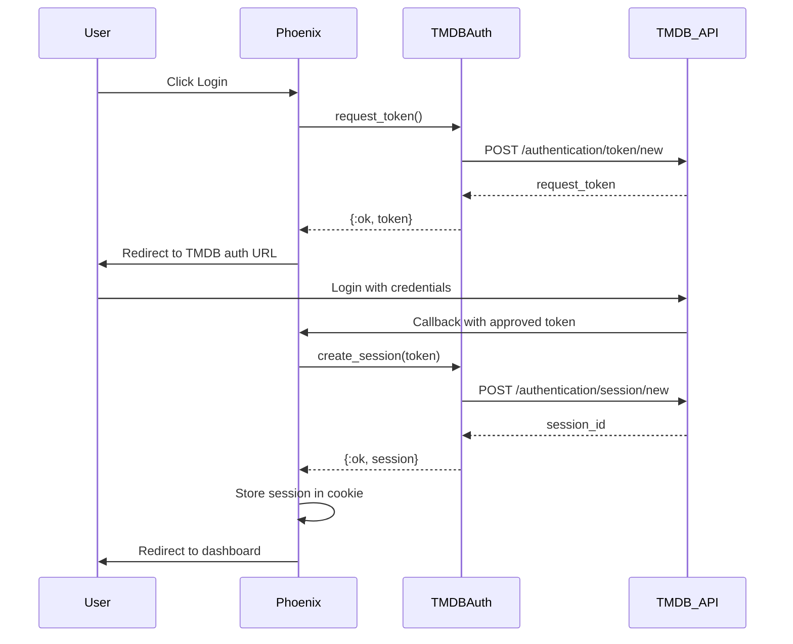

# Design Document

## Overview

This design implements user authentication using The Movie Database (TMDB) API's session-based authentication system. The implementation follows TMDB's three-step authentication flow: request token creation, token validation with user credentials, and session creation. The system will integrate with Phoenix's session management and provide secure, persistent authentication for users to access TMDB-specific features.

The authentication system will be built as a new context (`Flixir.Auth`) following Phoenix conventions, with dedicated LiveView components for login/logout functionality and session management middleware.

## Architecture

### Authentication Flow



### System Components

1. **Auth Context** (`Flixir.Auth`)
   - Core authentication business logic
   - Session management functions
   - User data retrieval

2. **TMDB Auth Client** (`Flixir.Auth.TMDBClient`)
   - TMDB API authentication endpoints
   - Token and session management
   - Error handling for auth-specific scenarios

3. **Auth LiveView** (`FlixirWeb.AuthLive`)
   - Login/logout UI components
   - Authentication state management
   - User feedback and error display

4. **Session Plug** (`FlixirWeb.Plugs.AuthSession`)
   - Session validation middleware
   - Automatic session refresh
   - User context injection

## Components and Interfaces

### Auth Context (`lib/flixir/auth.ex`)

```elixir
defmodule Flixir.Auth do
  @moduledoc """
  Authentication context for TMDB user sessions.
  """

  @doc "Initiates TMDB authentication flow"
  def start_authentication() :: {:ok, String.t()} | {:error, term()}

  @doc "Completes authentication with approved token"
  def complete_authentication(token) :: {:ok, Session.t()} | {:error, term()}

  @doc "Validates existing session"
  def validate_session(session_id) :: {:ok, Session.t()} | {:error, term()}

  @doc "Destroys user session"
  def logout(session_id) :: :ok | {:error, term()}

  @doc "Gets current user info from session"
  def get_current_user(session_id) :: {:ok, User.t()} | {:error, term()}
end
```

### Session Schema (`lib/flixir/auth/session.ex`)

```elixir
defmodule Flixir.Auth.Session do
  use Ecto.Schema
  import Ecto.Changeset

  @primary_key {:id, :binary_id, autogenerate: true}
  schema "auth_sessions" do
    field :tmdb_session_id, :string
    field :tmdb_user_id, :integer
    field :username, :string
    field :expires_at, :utc_datetime
    field :last_accessed_at, :utc_datetime

    timestamps()
  end
end
```

### TMDB Auth Client (`lib/flixir/auth/tmdb_client.ex`)

```elixir
defmodule Flixir.Auth.TMDBClient do
  @moduledoc """
  TMDB API client for authentication operations.
  """

  @doc "Creates a new request token"
  def create_request_token() :: {:ok, map()} | {:error, term()}

  @doc "Creates session from approved token"
  def create_session(token) :: {:ok, map()} | {:error, term()}

  @doc "Deletes/invalidates a session"
  def delete_session(session_id) :: {:ok, map()} | {:error, term()}

  @doc "Gets account details for session"
  def get_account_details(session_id) :: {:ok, map()} | {:error, term()}
end
```

### Auth LiveView (`lib/flixir_web/live/auth_live.ex`)

```elixir
defmodule FlixirWeb.AuthLive do
  use FlixirWeb, :live_view

  @doc "Handles login initiation"
  def handle_event("login", _params, socket)

  @doc "Handles authentication callback"
  def handle_params(%{"request_token" => token}, _uri, socket)

  @doc "Handles logout"
  def handle_event("logout", _params, socket)
end
```

## Data Models

### Database Schema

```sql
CREATE TABLE auth_sessions (
  id UUID PRIMARY KEY DEFAULT gen_random_uuid(),
  tmdb_session_id VARCHAR(255) NOT NULL UNIQUE,
  tmdb_user_id INTEGER NOT NULL,
  username VARCHAR(255) NOT NULL,
  expires_at TIMESTAMP WITH TIME ZONE NOT NULL,
  last_accessed_at TIMESTAMP WITH TIME ZONE NOT NULL,
  inserted_at TIMESTAMP WITH TIME ZONE NOT NULL DEFAULT NOW(),
  updated_at TIMESTAMP WITH TIME ZONE NOT NULL DEFAULT NOW()
);

CREATE INDEX idx_auth_sessions_tmdb_session_id ON auth_sessions(tmdb_session_id);
CREATE INDEX idx_auth_sessions_expires_at ON auth_sessions(expires_at);
```

### Session Data Structure

```elixir
%Flixir.Auth.Session{
  id: "uuid",
  tmdb_session_id: "tmdb_session_string",
  tmdb_user_id: 12345,
  username: "user123",
  expires_at: ~U[2024-01-01 00:00:00Z],
  last_accessed_at: ~U[2024-01-01 00:00:00Z]
}
```

### User Data Structure (from TMDB)

```elixir
%{
  "id" => 12345,
  "username" => "user123",
  "name" => "John Doe",
  "include_adult" => false,
  "iso_639_1" => "en",
  "iso_3166_1" => "US",
  "avatar" => %{
    "gravatar" => %{"hash" => "hash_string"},
    "tmdb" => %{"avatar_path" => "/path/to/avatar.jpg"}
  }
}
```

## Error Handling

### Authentication Errors

1. **Token Request Failures**
   - Network timeouts → Retry with exponential backoff
   - API errors → Display user-friendly message
   - Rate limiting → Show temporary unavailability message

2. **Session Creation Failures**
   - Invalid/expired token → Restart authentication flow
   - User denial → Return to login with explanation
   - API errors → Log error, show generic failure message

3. **Session Validation Failures**
   - Expired session → Clear local session, prompt re-login
   - Invalid session → Clear local session, redirect to login
   - Network errors → Allow graceful degradation

### Error Response Format

```elixir
{:error, %{
  type: :authentication_failed | :session_expired | :network_error | :api_error,
  message: "User-friendly error message",
  details: %{...}, # Technical details for logging
  retry_after: nil | integer() # Seconds to wait before retry
}}
```

## Testing Strategy

### Unit Tests

1. **Auth Context Tests**
   - Test all public functions with various inputs
   - Mock TMDB API responses
   - Test error handling scenarios
   - Test session validation logic

2. **TMDB Client Tests**
   - Test API request formatting
   - Test response parsing
   - Test error handling for different HTTP status codes
   - Test retry logic and timeouts

3. **Session Schema Tests**
   - Test changeset validations
   - Test data transformations
   - Test expiration logic

### Integration Tests

1. **Authentication Flow Tests**
   - Test complete login flow (mocked TMDB responses)
   - Test logout functionality
   - Test session persistence across requests
   - Test session expiration handling

2. **LiveView Tests**
   - Test login UI interactions
   - Test authentication state changes
   - Test error message display
   - Test navigation after login/logout

3. **Plug Tests**
   - Test session validation middleware
   - Test user context injection
   - Test redirect behavior for unauthenticated users

### API Integration Tests

1. **TMDB API Tests** (with real API, tagged for CI exclusion)
   - Test token creation with real TMDB API
   - Test session creation flow
   - Test account details retrieval
   - Test session deletion

## Security Considerations

### Session Security

1. **Secure Cookies**
   - Use `secure: true` for HTTPS-only cookies
   - Set `http_only: true` to prevent XSS access
   - Use `same_site: :lax` for CSRF protection

2. **Session Encryption**
   - Encrypt session IDs in cookies using Phoenix's signed cookies
   - Store minimal data in cookies (only session ID)
   - Use database for sensitive session data

3. **Session Management**
   - Implement session expiration based on TMDB session lifetime
   - Provide session invalidation on logout
   - Clean up expired sessions with background job

### API Security

1. **TMDB API Protection**
   - Never expose TMDB API key to client-side code
   - Use server-side proxy for all TMDB API calls
   - Implement rate limiting to prevent API abuse

2. **Input Validation**
   - Validate all authentication parameters
   - Sanitize user inputs before API calls
   - Implement CSRF protection for authentication forms

### Data Protection

1. **Sensitive Data Handling**
   - Never store user passwords locally
   - Encrypt session data in database
   - Log authentication events without sensitive data

2. **Privacy Compliance**
   - Implement data retention policies for sessions
   - Provide user data deletion capabilities
   - Follow GDPR guidelines for user data handling

## Configuration

### Environment Variables

```elixir
# config/runtime.exs
config :flixir, :tmdb_auth,
  api_key: System.get_env("TMDB_API_KEY"),
  base_url: System.get_env("TMDB_BASE_URL") || "https://api.themoviedb.org/3",
  redirect_url: System.get_env("TMDB_REDIRECT_URL") || "http://localhost:4000/auth/callback",
  session_timeout: String.to_integer(System.get_env("TMDB_SESSION_TIMEOUT") || "86400")
```

### Phoenix Session Configuration

```elixir
# config/config.exs
config :flixir_web, FlixirWeb.Endpoint,
  session: [
    store: :cookie,
    key: "_flixir_key",
    signing_salt: "session_salt",
    max_age: 86400, # 24 hours
    secure: true,
    http_only: true,
    same_site: "Lax"
  ]
```

## Implementation Notes

### TMDB Authentication Flow Details

1. **Step 1: Request Token**
   - POST to `/authentication/token/new`
   - Returns `request_token` with 60-minute expiration
   - Token must be approved by user on TMDB website

2. **Step 2: User Authorization**
   - Redirect user to `https://www.themoviedb.org/authenticate/{request_token}?redirect_to={callback_url}`
   - User logs in and approves application access
   - TMDB redirects back to callback URL with approved token

3. **Step 3: Session Creation**
   - POST to `/authentication/session/new` with approved token
   - Returns `session_id` for authenticated API calls
   - Session remains valid until explicitly deleted

### Phoenix Integration Points

1. **Router Configuration**
   - Add authentication routes (`/auth/login`, `/auth/callback`, `/auth/logout`)
   - Protect routes that require authentication
   - Add session validation pipeline

2. **LiveView Integration**
   - Add authentication state to socket assigns
   - Handle authentication events in LiveView
   - Update UI based on authentication status

3. **Session Management**
   - Store session data in Phoenix sessions
   - Implement session validation plug
   - Handle session expiration gracefully