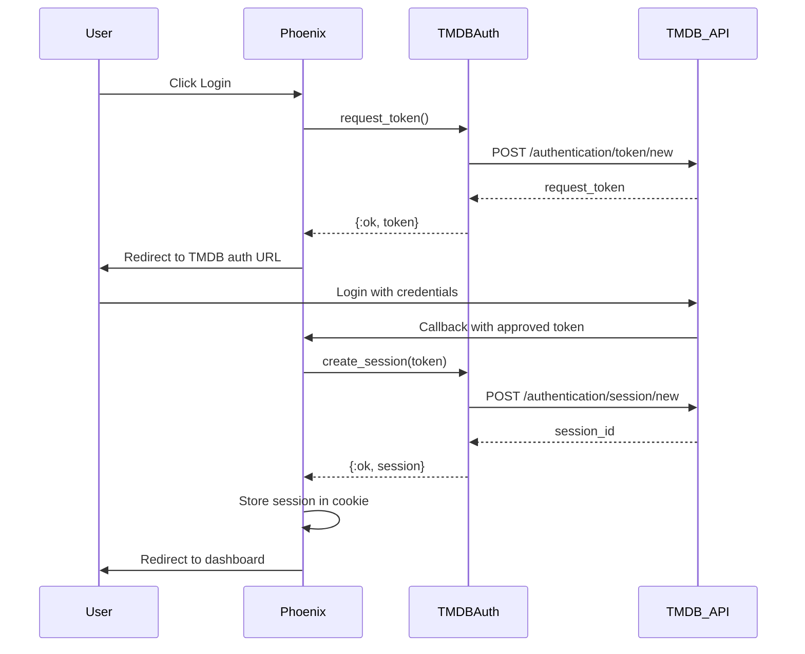

# Authentication System Documentation

This document provides comprehensive documentation for Flixir's TMDB authentication system.

## Overview

Flixir implements user authentication using The Movie Database (TMDB) API's session-based authentication system. The implementation follows TMDB's three-step authentication flow and provides secure, persistent user sessions with comprehensive error handling and automatic cleanup.

## Architecture

### Authentication Flow

The authentication process follows TMDB's official three-step flow:

1. **Token Request**: Application requests a request token from TMDB
2. **User Approval**: User is redirected to TMDB to approve the token with their credentials  
3. **Session Creation**: Approved token is exchanged for an authenticated session



### Core Components

#### 1. Auth Context (`Flixir.Auth`)

The main authentication context provides the public API for authentication operations:

```elixir
defmodule Flixir.Auth do
  @doc "Initiates TMDB authentication flow"
  def start_authentication() :: {:ok, String.t()} | {:error, term()}

  @doc "Completes authentication with approved token"
  def complete_authentication(token) :: {:ok, Session.t()} | {:error, term()}

  @doc "Validates existing session"
  def validate_session(session_id) :: {:ok, Session.t()} | {:error, term()}

  @doc "Destroys user session"
  def logout(session_id) :: :ok | {:error, term()}

  @doc "Gets current user info from session"
  def get_current_user(session_id) :: {:ok, User.t()} | {:error, term()}
end
```

#### 2. TMDB Client (`Flixir.Auth.TMDBClient`)

Handles direct communication with TMDB's authentication API:

```elixir
defmodule Flixir.Auth.TMDBClient do
  @doc "Creates a new request token"
  def create_request_token() :: {:ok, map()} | {:error, term()}

  @doc "Creates session from approved token"
  def create_session(token) :: {:ok, map()} | {:error, term()}

  @doc "Deletes/invalidates a session"
  def delete_session(session_id) :: {:ok, map()} | {:error, term()}

  @doc "Gets account details for session"
  def get_account_details(session_id) :: {:ok, map()} | {:error, term()}
end
```

#### 3. Session Schema (`Flixir.Auth.Session`)

Database schema for storing session information:

```elixir
defmodule Flixir.Auth.Session do
  use Ecto.Schema
  import Ecto.Changeset

  @primary_key {:id, :binary_id, autogenerate: true}
  schema "auth_sessions" do
    field :tmdb_session_id, :string
    field :tmdb_user_id, :integer
    field :username, :string
    field :expires_at, :utc_datetime
    field :last_accessed_at, :utc_datetime

    timestamps()
  end
end
```

#### 4. Session Management Plug (`FlixirWeb.Plugs.AuthSession`)

Middleware that handles session validation and user context injection:

- Validates session IDs from cookies against the database
- Injects current user data and session information into conn assigns
- Handles expired sessions with automatic cleanup
- Provides optional authentication enforcement
- Comprehensive logging for security monitoring

#### 5. LiveView Integration (`FlixirWeb.AuthHooks`)

Centralized authentication state management for LiveView components:

- Transfers authentication state from HTTP connection to LiveView socket
- Validates sessions on LiveView mount
- Ensures consistent authentication assigns across all LiveViews
- Eliminates duplicate authentication code

#### 6. Session Cleanup (`Flixir.Auth.SessionCleanup`)

Background service for maintaining session hygiene:

- Automatic cleanup of expired and idle sessions
- Configurable cleanup intervals
- Manual cleanup triggers with statistics
- Comprehensive logging and error handling

## Configuration

The TMDB authentication system is now **enabled by default** in the runtime configuration (`config/runtime.exs`). The following configuration is automatically active:

```elixir
# TMDB Authentication configuration (enabled by default)
config :flixir, :tmdb_auth,
  api_key: System.get_env("TMDB_API_KEY"),
  base_url: System.get_env("TMDB_BASE_URL") || "https://api.themoviedb.org/3",
  redirect_url: System.get_env("TMDB_REDIRECT_URL") || "http://localhost:4000/auth/callback",
  session_timeout: String.to_integer(System.get_env("TMDB_SESSION_TIMEOUT") || "86400")
```

### Environment Variables

**Required:**
```bash
export TMDB_API_KEY="your_tmdb_api_key_here"
```

**Optional (now enabled by default in runtime configuration):**
```bash
# TMDB API configuration
export TMDB_BASE_URL="https://api.themoviedb.org/3"
export TMDB_REDIRECT_URL="http://localhost:4000/auth/callback"

# Session configuration
export TMDB_SESSION_TIMEOUT="86400"  # 24 hours
export SESSION_MAX_AGE="86400"       # 24 hours
export SESSION_CLEANUP_INTERVAL="3600"  # 1 hour
export SESSION_MAX_IDLE="7200"       # 2 hours

# Production security
export SECRET_KEY_BASE="your_generated_secret"
export SESSION_SIGNING_SALT="your_generated_salt"
export SESSION_ENCRYPTION_SALT="your_generated_salt"
export LIVEVIEW_SIGNING_SALT="your_generated_salt"
```

### Phoenix Configuration

The authentication system integrates with Phoenix's session management:

```elixir
# config/config.exs
config :flixir, FlixirWeb.Endpoint,
  session: [
    store: :cookie,
    key: "_flixir_key",
    signing_salt: "session_salt_key_change_in_prod",
    encryption_salt: "session_encrypt_salt_change_in_prod",
    max_age: 86400,
    secure: false,      # Will be true in production
    http_only: true,
    same_site: "Lax"    # Will be "Strict" in production
  ]
```

## Database Schema

The authentication system requires the `auth_sessions` table:

```sql
CREATE TABLE auth_sessions (
  id UUID PRIMARY KEY DEFAULT gen_random_uuid(),
  tmdb_session_id VARCHAR(255) NOT NULL UNIQUE,
  tmdb_user_id INTEGER NOT NULL,
  username VARCHAR(255) NOT NULL,
  expires_at TIMESTAMP WITH TIME ZONE NOT NULL,
  last_accessed_at TIMESTAMP WITH TIME ZONE NOT NULL,
  inserted_at TIMESTAMP WITH TIME ZONE NOT NULL DEFAULT NOW(),
  updated_at TIMESTAMP WITH TIME ZONE NOT NULL DEFAULT NOW()
);

CREATE INDEX idx_auth_sessions_tmdb_session_id ON auth_sessions(tmdb_session_id);
CREATE INDEX idx_auth_sessions_expires_at ON auth_sessions(expires_at);
```

## API Usage

### Basic Authentication Flow

```elixir
# 1. Start authentication
case Flixir.Auth.start_authentication() do
  {:ok, auth_url} -> 
    # Redirect user to TMDB
    redirect(socket, external: auth_url)
  {:error, reason} -> 
    # Handle error
    put_flash(socket, :error, "Authentication unavailable")
end

# 2. Handle callback
case Flixir.Auth.complete_authentication(approved_token) do
  {:ok, session} ->
    # Store session and redirect
    conn = FlixirWeb.Plugs.AuthSession.put_session_id(conn, session.id)
    redirect(conn, to: "/dashboard")
  {:error, reason} ->
    # Handle error
    redirect(conn, to: "/auth/login?error=failed")
end

# 3. Logout
case Flixir.Auth.logout(session_id) do
  :ok ->
    conn = FlixirWeb.Plugs.AuthSession.clear_session_id(conn)
    redirect(conn, to: "/")
  {:error, reason} ->
    # Log error but still clear local session
    Logger.warning("Logout error: #{inspect(reason)}")
    conn = FlixirWeb.Plugs.AuthSession.clear_session_id(conn)
    redirect(conn, to: "/")
end
```

### Session Validation

```elixir
# Automatic validation via AuthSession plug
case Flixir.Auth.validate_session(session_id) do
  {:ok, session} -> 
    # Session valid, get user data
    {:ok, user} = Flixir.Auth.get_current_user(session.tmdb_session_id)
  {:error, :session_expired} -> 
    # Clear session and prompt re-authentication
    clear_session_and_redirect()
  {:error, :session_not_found} -> 
    # Invalid session, continue as unauthenticated
    clear_session()
end
```

### LiveView Integration

```elixir
defmodule MyAppWeb.SomeLive do
  use MyAppWeb, :live_view

  def mount(_params, _session, socket) do
    # Authentication state automatically available via AuthHooks
    if socket.assigns.authenticated? do
      user_content = load_user_content(socket.assigns.current_user)
      {:ok, assign(socket, :user_content, user_content)}
    else
      public_content = load_public_content()
      {:ok, assign(socket, :public_content, public_content)}
    end
  end
end
```

## Error Handling

### Error Types

The authentication system handles various error scenarios:

1. **Network Errors**: Connection timeouts, DNS failures
2. **API Errors**: TMDB API unavailability, invalid responses
3. **Rate Limiting**: TMDB API rate limit exceeded
4. **Authentication Errors**: Invalid tokens, denied requests
5. **Session Errors**: Expired sessions, invalid session IDs

### Error Handler

The `Flixir.Auth.ErrorHandler` provides consistent error handling:

```elixir
case Flixir.Auth.TMDBClient.create_request_token() do
  {:ok, token_data} -> 
    handle_token(token_data)
  {:error, error} -> 
    case Flixir.Auth.ErrorHandler.handle_error(error, :token_creation) do
      {:retry, delay} -> 
        # Schedule retry after delay
        Process.send_after(self(), :retry_token_creation, delay)
      {:user_error, message} -> 
        # Show user-friendly error
        put_flash(socket, :error, message)
      {:system_error, message} -> 
        # Log technical error, show generic message
        Logger.error("Token creation failed: #{message}")
        put_flash(socket, :error, "Authentication temporarily unavailable")
    end
end
```

### Retry Logic

The system implements exponential backoff with jitter for transient failures:

- **Initial Delay**: 1 second
- **Maximum Delay**: 30 seconds
- **Jitter**: ±25% to prevent thundering herd
- **Maximum Retries**: 3 attempts

## Security

### Session Security

1. **Encrypted Cookies**: All session data stored in encrypted, signed cookies
2. **HTTP-Only**: Cookies marked HTTP-only to prevent XSS attacks
3. **Secure Flag**: HTTPS-only cookies in production
4. **SameSite Protection**: CSRF protection through SameSite attributes

### Session Management

1. **Automatic Expiration**: Sessions expire based on TMDB session lifetime
2. **Idle Timeout**: Sessions expire after periods of inactivity
3. **Background Cleanup**: Periodic cleanup of expired sessions
4. **Secure Storage**: Session data encrypted in database

### Production Security

1. **HTTPS Only**: All authentication flows require HTTPS
2. **Secret Management**: Secure generation and storage of secrets
3. **CSRF Protection**: Built-in CSRF protection via Phoenix
4. **Input Validation**: All authentication parameters validated

## Monitoring

### Session Statistics

```elixir
# Get cleanup statistics
iex> Flixir.Auth.SessionCleanup.get_stats()
%{
  total_sessions: 150,
  expired_sessions: 12,
  idle_sessions: 8,
  last_cleanup: ~U[2024-01-15 10:30:00Z],
  cleanup_interval: 3600
}

# Manual cleanup
iex> Flixir.Auth.SessionCleanup.cleanup_expired_sessions()
{:ok, %{cleaned: 20, errors: 0}}
```

### Logging

The authentication system provides comprehensive logging:

- **Authentication Events**: Login attempts, successful authentications, logouts
- **Error Events**: Failed API calls, network errors, session validation failures
- **Security Events**: Invalid session attempts, expired session cleanup
- **Performance Events**: API response times, retry attempts

### Telemetry

Authentication events are instrumented with telemetry for monitoring:

- `[:flixir, :auth, :login, :start]` - Authentication flow initiated
- `[:flixir, :auth, :login, :complete]` - Authentication completed
- `[:flixir, :auth, :logout]` - User logout
- `[:flixir, :auth, :session, :validate]` - Session validation
- `[:flixir, :auth, :error]` - Authentication errors

## Testing

### Test Coverage

The authentication system includes comprehensive tests:

1. **Unit Tests**: Individual module and function testing
2. **Integration Tests**: End-to-end authentication flow testing
3. **LiveView Tests**: Authentication UI interaction testing
4. **Security Tests**: Session security and error handling testing
5. **API Tests**: TMDB API integration testing (with mocks)

### Running Tests

```bash
# Run all authentication tests
mix test test/flixir/auth*

# Run integration tests
mix test test/flixir_web/integration/auth_flow_test.exs

# Run with coverage
mix test --cover test/flixir/auth*
```

## Troubleshooting

### Common Issues

1. **"Authentication unavailable"**
   - Check TMDB_API_KEY environment variable
   - Verify TMDB API connectivity
   - Check application logs for specific errors

2. **"Session expired" errors**
   - Check TMDB_SESSION_TIMEOUT configuration
   - Verify session cleanup is not too aggressive
   - Check for clock synchronization issues

3. **Redirect loops**
   - Verify TMDB_REDIRECT_URL matches your application URL
   - Check for conflicting session configurations
   - Ensure proper route configuration

4. **Cookie issues**
   - Verify session configuration in config files
   - Check for secure cookie settings in development
   - Ensure proper domain configuration

### Debug Mode

Enable debug logging for authentication:

```elixir
# config/dev.exs
config :logger, level: :debug

# Or in runtime
Logger.configure(level: :debug)
```

### Manual Session Management

```elixir
# Check session status
iex> session_id = "your-session-id"
iex> Flixir.Auth.validate_session(session_id)

# Force session cleanup
iex> Flixir.Auth.SessionCleanup.cleanup_expired_sessions()

# Get user information
iex> Flixir.Auth.get_current_user("tmdb-session-id")
```

## Migration Guide

### From Previous Versions

If upgrading from a version without authentication:

1. Run database migrations:
   ```bash
   mix ecto.migrate
   ```

2. Update configuration files with authentication settings

3. Add TMDB_API_KEY environment variable

4. Update any custom authentication code to use the new system

### Configuration Changes

The authentication system uses centralized configuration. Update any hardcoded values to use the configuration system:

```elixir
# Old
@api_key "hardcoded_key"

# New
@api_key Application.get_env(:flixir, :tmdb_auth)[:api_key]
```

## Contributing

When contributing to the authentication system:

1. **Security First**: All changes must maintain or improve security
2. **Test Coverage**: New features require comprehensive tests
3. **Documentation**: Update this document for any API changes
4. **Backward Compatibility**: Maintain compatibility where possible
5. **Error Handling**: Ensure robust error handling for all scenarios

### Code Style

Follow the established patterns:

- Use pattern matching for error handling
- Implement comprehensive logging
- Include telemetry events for monitoring
- Follow Phoenix and Elixir conventions
- Write clear, descriptive function documentation