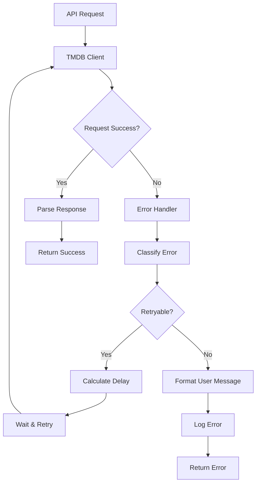

# TMDB Authentication Error Handling Implementation

This document describes the comprehensive error handling system implemented for TMDB authentication in the Flixir application.

## Overview

The error handling system provides:
- **Graceful handling of TMDB API unavailability**
- **Retry logic with exponential backoff for network errors**
- **User-friendly error messages for authentication failures**
- **Appropriate handling of rate limiting from TMDB API**
- **Comprehensive logging for authentication events and errors**

## Components

### 1. Error Handler (`lib/flixir/auth/error_handler.ex`) ✅ IMPLEMENTED

Central error handling module that provides:

#### Error Classification
- **Network Errors**: Timeouts, connection refused, DNS issues
- **Rate Limiting**: HTTP 429 responses and rate limit exceeded
- **Service Unavailable**: HTTP 5xx responses, invalid response formats
- **Authentication Failed**: HTTP 401, token/session creation failures
- **Session Expired**: Invalid sessions, expired tokens
- **API Key Invalid**: HTTP 403, configuration errors
- **Unknown**: Unclassified errors

#### Retry Logic
- **Exponential backoff** with jitter to prevent thundering herd
- **Attempt limits** (max 3 attempts for retryable errors)
- **Custom delays** for different error types (longer for rate limiting)
- **Test environment support** (no retries in tests to prevent timeouts)

#### User-Friendly Messages
- Clear, non-technical error messages for end users
- Context-appropriate guidance (e.g., "check your connection")
- Consistent messaging across all error types

#### Telemetry Support
- Structured error data for monitoring and alerting
- Operation context, attempt counts, user information
- Timestamps and retry status for analysis

### 2. Enhanced TMDB Client (`lib/flixir/auth/tmdb_client.ex`)

#### Retry Integration
- Automatic retry for transient errors (network, service unavailable)
- Exponential backoff with configurable delays
- Comprehensive logging at appropriate levels
- URL sanitization for secure logging (removes API keys)

#### Error Response Handling
- Detailed parsing of TMDB API error responses
- Status code classification (401, 403, 429, 5xx)
- Transport error handling (timeouts, connection issues)
- Response format validation

#### Configuration
- Increased default timeout (10 seconds) for better reliability
- Environment-aware retry behavior (disabled in tests)
- Secure API key validation and error reporting

### 3. Enhanced Auth Context (`lib/flixir/auth.ex`)

#### Operation Logging
- Structured logging with operation context
- User and session information in logs
- Success and failure event tracking
- Error message formatting for user display

#### Error Propagation
- Consistent error format across all auth operations
- User-friendly error messages using centralized handler
- Technical details preserved for debugging

### 4. Enhanced Auth LiveView (`lib/flixir_web/live/auth_live.ex`)

#### User Experience
- Centralized error message formatting
- Context-aware error messages with additional guidance
- Loading states and user feedback
- Graceful error recovery options

## Error Handling Flow



## Error Types and Handling

| Error Type | Retryable | Delay | User Message | Log Level |
|------------|-----------|-------|--------------|-----------|
| Network Error | Yes (3x) | 1s, 2s, 4s | "Unable to connect to TMDB..." | Info (first), Error (final) |
| Rate Limited | Yes (3x) | 30s, 60s, 60s | "Too many authentication attempts..." | Warning |
| Service Unavailable | Yes (3x) | 5s, 10s, 20s | "TMDB service temporarily unavailable..." | Error |
| Authentication Failed | No | - | "Authentication failed. Check credentials..." | Warning |
| Session Expired | No | - | "Your session has expired..." | Info |
| API Key Invalid | No | - | "Configuration error. Contact support..." | Error |

## Logging Strategy

### Log Levels
- **Debug**: Successful operations, response parsing
- **Info**: Session lifecycle events, retry attempts
- **Warning**: Authentication failures, rate limiting
- **Error**: Service errors, configuration issues, final failures

### Log Structure
```elixir
Logger.error("Authentication error in create_session", %{
  error_type: :network_error,
  original_error: inspect(error),
  attempt: 2,
  operation: :create_session,
  user_id: "user123",
  session_id: "session456"
})
```

### Security Considerations
- API keys are sanitized from URLs in logs
- Sensitive user data is not logged
- Error details are preserved for debugging without exposing credentials

## Configuration

### Environment Variables
- `TMDB_API_KEY`: Required API key for TMDB access
- `TMDB_BASE_URL`: TMDB API base URL (defaults to official API)
- `TMDB_SESSION_TIMEOUT`: Session timeout in seconds (default: 86400)

### Application Configuration
```elixir
config :flixir, :tmdb,
  api_key: System.get_env("TMDB_API_KEY"),
  base_url: "https://api.themoviedb.org/3",
  timeout: 10_000
```

## Testing

### Unit Tests
- Error classification for all error types
- Retry logic and exponential backoff
- User message formatting
- Telemetry data structure

### Integration Tests
- End-to-end error handling flows
- Logging integration and levels
- API unavailability detection
- User experience scenarios

### Test Environment
- Retries disabled to prevent test timeouts
- Mock-friendly error simulation
- Comprehensive error scenario coverage

## Monitoring and Alerting

### Key Metrics
- Error rates by type and operation
- Retry attempt distributions
- API availability indicators
- Authentication success/failure rates

### Telemetry Events
```elixir
:telemetry.execute([:flixir, :auth, :error], %{count: 1}, %{
  error_type: :network_error,
  operation: :create_session,
  retryable: true,
  user_id: "user123"
})
```

## Best Practices

### For Developers
1. Always use the centralized error handler for consistent behavior
2. Include operation context in error handling calls
3. Use structured logging with appropriate metadata
4. Test error scenarios with comprehensive mocks

### For Operations
1. Monitor error rates and patterns for early issue detection
2. Set up alerts for API key issues and service unavailability
3. Track retry patterns to identify systemic issues
4. Use telemetry data for capacity planning and optimization

## Future Enhancements

### Potential Improvements
- Circuit breaker pattern for repeated failures
- Adaptive retry delays based on API response headers
- Error rate limiting to prevent API abuse
- Enhanced telemetry with custom metrics
- Integration with external monitoring services

### Scalability Considerations
- Connection pooling for high-volume scenarios
- Distributed rate limiting across multiple instances
- Caching strategies for reduced API dependency
- Graceful degradation modes for extended outages